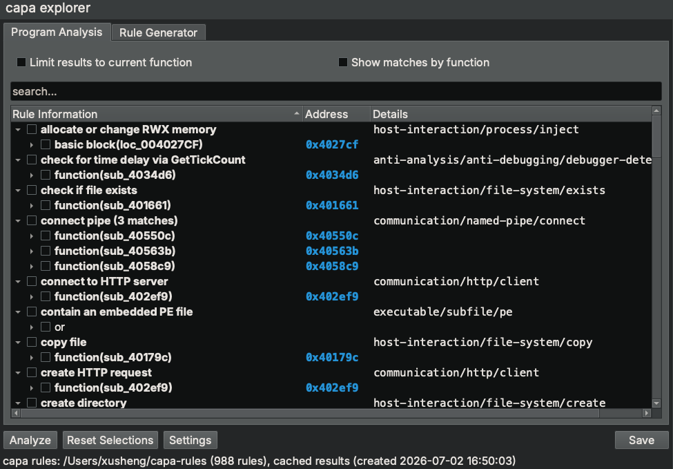

# capa explorer for Binary Ninja

capa explorer is a Binary Ninja UI plugin that integrates the FLARE team's open-source
[capa](https://github.com/mandiant/capa) framework with Binary Ninja. capa uses a
collection of rules to identify capabilities in a program — for example, that a sample
is a backdoor, can install services, or communicates over HTTP. capa explorer runs this
analysis against your current `BinaryView` and lets you explore *why* each capability
matched.

It is the Binary Ninja counterpart to the
[IDA Pro capa explorer plugin](https://github.com/mandiant/capa/tree/master/capa/ida/plugin),
with a **Program Analysis** view and a **Rule Generator**, built around Binary Ninja
idioms (sidebar widget, background tasks, `UIContext` navigation, `.bndb` metadata).

## Relationship to capa

This repository ships **only the UI**. The capability-matching engine and the Binary
Ninja feature extractor live in the `flare-capa` Python package, which Binary Ninja
installs for you from [`requirements.txt`](requirements.txt). Keeping the UI separate
means it can be installed and updated through Binary Ninja's plugin manager independently
of how (or whether) you use capa from the command line.

## Features

**Program Analysis tab**

- Click **Analyze** to run capa over the whole binary. Matches render as a tree:
  rule → function → basic block / instruction → feature.
- Double-click the **Address** column to navigate the active view to that address.
- Tick a row's checkbox to highlight the corresponding instruction in the disassembly.
- From the **☰** menu (top-right of the sidebar): **Limit results to current function**
  filters the tree to the function under the cursor and follows you as you navigate, and
  **Show matches by function** regroups matches under the functions that contain them.
- Search to filter by rule name or any feature text (e.g. `characteristic(nzxor)`).
- Right-click a function row to rename it (pushed to Binary Ninja).
- Hover a rule to see its source; **Export** saves the results as capa JSON.
- Results are cached inside the `.bndb` and reused across sessions.

**Rule Generator tab**

- Navigate to a function, click **Analyze**, and capa extracts its features.
- Double-click features (or multi-select + right-click) to add them to the editor.
- Drag-and-drop to build your statement hierarchy; the preview shows live YAML.
- The preview border turns green when the rule compiles and matches the current function,
  yellow when it compiles but doesn't match, and red on a compile error.
- **Export** writes the rule to a `.yml` file.

## Installation

### From the Binary Ninja plugin manager (recommended)

Once this repo is listed in the community plugin manager, open **Plugins → Manage
Plugins**, search for *capa explorer*, and install it. Binary Ninja clones the repo and
installs `flare-capa` from `requirements.txt` into the Python environment it uses.

Then download and extract the
[official capa rules](https://github.com/mandiant/capa-rules/releases) matching your
installed capa version (`capa --version`). On first run the plugin prompts for this
directory (and remembers it via Binary Ninja settings).

### Manual install (for development)

1. Ensure `flare-capa` is installed for the Python interpreter Binary Ninja uses
   (`Settings → Python interpreter`), e.g. `pip install flare-capa`.
2. Clone this repo into your Binary Ninja user plugins folder, or symlink it there:
   - macOS: `~/Library/Application Support/Binary Ninja/plugins/`
   - Linux: `~/.binaryninja/plugins/`
   - Windows: `%APPDATA%\Binary Ninja\plugins\`

   The plugin loads as a Python package (Binary Ninja runs its `__init__.py`), so the
   directory name must be a valid Python identifier (e.g. `capa_explorer`, not
   `capa-explorer-binja`).

## Usage

1. Get the capa rules. capa does **not** ship rules with the `flare-capa` package,
   so you need a local copy: download and extract the
   [official capa rules](https://github.com/mandiant/capa-rules/releases) release that
   matches your installed capa version (`capa --version`).
2. Open a supported file (x86 / x86-64 PE, ELF, or shellcode) and let analysis finish.
3. Open the **capa explorer** panel from the sidebar.
4. Click **Analyze** on the **Program Analysis** tab. The first time, the plugin asks
   for your capa rules directory (from step 1) and remembers it in Binary Ninja's
   settings; you can change it later from the **☰** menu → **Settings**. Then try
   double-clicking addresses, ticking a row's checkbox to highlight it, the **☰** view
   options, and search — and the **Rule Generator** tab on a function.

## Notes / differences from the IDA plugin

The plugin follows Binary Ninja conventions rather than reproducing the IDA
implementation line for line:

| Concern | IDA plugin | This plugin |
| --- | --- | --- |
| Host UI | `idaapi.PluginForm` docked window | `SidebarWidget` |
| Long-running analysis | IDA wait box on the UI thread | `BackgroundTaskThread` + `execute_on_main_thread` |
| Navigation | `idc.jumpto` | `UIContext.navigateForBinaryView` |
| Highlighting | `idc.set_color` (RGB, restores prior color) | `Function.set_user_instr_highlight` (standard yellow) |
| Result caching | IDA netnode | `BinaryView` metadata in the `.bndb` |
| Settings | `ida_settings` | `binaryninja.Settings` (also in Preferences) |
| Location/rename events | `idaapi.UI_Hooks` | `UIContextNotification` |
| Feature extractor | `capa.features.extractors.ida` | `capa.features.extractors.binja` (from `flare-capa`) |

Behavioral notes:

- **Highlight restore.** Binary Ninja's instruction highlight is keyed by
  `(function, architecture)` and isn't cheaply readable, so checking a row applies a
  standard yellow highlight and unchecking clears it (rather than restoring a prior user
  highlight).
- **No "analyze on plugin start" option** — Binary Ninja creates the sidebar widget
  lazily per view; click **Analyze** (the cached-results prompt still appears when a
  `.bndb` already contains capa results).
- **No rebase hook** — reanalyze manually if you rebase.
- **Architecture support** — x86 (32- and 64-bit), matching the IDA plugin.

## Credits

The sidebar icon is capa's project icon (`.github/icon.png` from
[mandiant/capa](https://github.com/mandiant/capa)), reused under the Apache-2.0 license.

## License

Apache-2.0. See [LICENSE](LICENSE).
